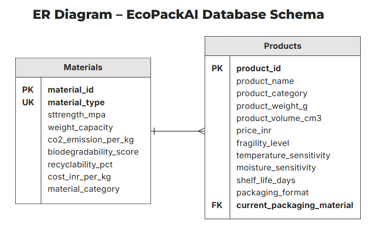

# 📦 EcoPackAI: AI-Powered Sustainable Packaging Recommendation System

## 📘 Introduction

**EcoPackAI** is a data-driven system designed to optimize packaging material choices by balancing environmental sustainability, cost-efficiency, and material suitability. In contrast to traditional heuristic-based approaches, EcoPackAI leverages structured data, engineered features, and composite scoring to recommend the most effective and eco-friendly packaging materials for diverse products.

---


## 🎯 Project Objectives

- Design a validated, production-ready relational database
- Engineer sustainability and cost-related features
- Compute composite indices:
  - CO₂ Impact Index
  - Cost Efficiency Index
  - Material Suitability Score
- Enable future ML model and dashboard integration
- Maintain real-world alignment and scalability

---

## 🧱 System Architecture Overview

The pipeline is modular and production-focused:

1. Raw data ingestion (CSV → PostgreSQL)
2. Schema validation & referential integrity checks
3. Data validation & cleaning
4. Feature engineering & scoring
5. Recommendation logic (planned)
6. Dashboard visualization (Tableau / Power BI)

---

## 🗃️ Database Design

- **Database:** PostgreSQL  
- **Name:** `ecopack_ai`

Key principles:
- Schema enforcement
- Data integrity via constraints and foreign keys
- Clean joins and production-grade readiness

---

## 📋 Table Schema Design

### 🔹 `materials` Table

Stores physical, environmental, and economic attributes of packaging materials.

- **Primary Key:** `material_id`
- **Columns:**
  - `material_type`
  - `strength_mpa`
  - `weight_capacity`
  - `co2_emission_per_kg`
  - `biodegradability_score`
  - `recyclability_pct`
  - `cost_inr_per_kg`
  - `material_category`

**Constraints:**
- Numeric range checks
- Binary biodegradability
- Recyclability: 0–100
- Unique material identifiers

---

### 🔹 `products` Table

Captures product-specific packaging needs.

- **Primary Key:** `product_id`
- **Foreign Key:** `current_packaging_material → materials.material_type`
- **Columns:**
  - `product_name`
  - `product_category`
  - `product_weight_g`
  - `product_volume_cm3`
  - `price_inr`
  - `fragility_level` (Low/Medium/High)
  - `temperature_sensitivity` (Low/Medium/High)
  - `moisture_sensitivity` (Low/Medium/High)
  - `shelf_life_days`
  - `packaging_format`

**Constraints:**
- Categorical value control
- Positive numeric enforcement
- Referential integrity

---

## 🧩 Entity-Relationship (ER) Diagram



**Relationship:**
- One material → many products  
- Each product uses one material  
**Type:** One-to-Many (1:N)

This ensures minimal redundancy and scalable recommendations.

---

## 🔄 Data Engineering Process

### 📂 Data Sources

- Material properties inspired by real-world data
- Product attributes aligned with market categories

### 📈 Data Flow

- CSV ingestion → PostgreSQL via `COPY`
- Schema and referential checks at DB level
- Exported for Python-based processing

---

## ✅ Data Validation

Performed prior to transformation to ensure raw data quality:

- Row & column shape checks
- Type verification
- Null & duplicate checks (0 found)
- Range sanity checks
- Foreign key validation

**Result:** Passed all checks and marked ready for cleaning.

---

## 🧹 Data Cleaning

Focused on preserving integrity while correcting inconsistencies.

### Cleaning Steps:

- String normalization (trim, case)
- Type enforcement
- Categorical constraints
- Logical range checks
- Outlier flagging (1%–99%)

### Outlier Handling:

Outliers were **flagged, not removed** using:
- `flag_weight_outlier`
- `flag_volume_outlier`
- `flag_price_outlier`

---

## 🛠️ Feature Engineering

### Key Engineered Features:

- **Strength Level:** Categorized from `strength_mpa` (Low/Med/High)
- **Emission Score:** Inverted, normalized CO₂ emissions
- **Recyclability Index:** `recyclability_pct / 100`
- **CO₂ Impact Index:** Weighted score from emission, recyclability, biodegradability
- **Cost Efficiency Index:** Inverse cost × normalized strength
- **Material Suitability Score:** Composite of all indices for final ranking

These metrics enable objective, scalable recommendations.

---

## 📁 Project Folder Structure

```bash
EcoPackAI/
│
├── data/
│   ├── raw/
│   │   ├── materials.csv              # Original materials dataset
│   │   └── products.csv               # Original products dataset 
│   │
│   └── processed/
│       ├── materials_cleaned.csv      # Cleaned materials dataset
│       ├── products_cleaned.csv       # Cleaned products dataset
│       └── materials_featured.csv     # Featured dataset
│
├── notebooks/
│   ├── 01_data_validation.ipynb        # Sanity checks, schema validation
│   ├── 02_data_cleaning.ipynb          # Cleaning, unit fixes, encoding prep
│   ├── 03_feature_engineering.ipynb    # CO₂, cost, suitability Indexes
│   └── 04_summary_validation.ipynb     # Post-FE stats & checks
│
├── models/
│   ├── baseline/                       # Baseline ML models 
│
├── src/
│   ├── pipelines/
│   │   ├── __init__.py
│   │   ├── data_preprocessing.py       # Reusable cleaning logic
│   │   ├── feature_engineering.py      # Index calculations
│   │   └── model_training.py           # Recommendation / ML logic
│   │
│   ├── api/
│   │   ├── __init__.py
│   │   └── recommend.py                # Packaging recommendation API
│   │
│   └── utils/
│       ├── constants.py                # Category lists, mappings, weights
│       └── validators.py               # Data validation helpers
│
├── sql/
│   └── EcoPackAI_Database.sql          # PostgreSQL schema (materials + products)
├── screenshots/
├── dashboard/
│   ├── EcoPackAI_Dashboard.twbx        # Tableau OR Power BI file
│   └── screenshots/                    # Dashboard images for README
│
├── app.py                              # Flask app entry point
├── requirements.txt
├── .gitignore
├── README.md
└── deployment/                         # Render / Heroku configs


```

---

## 🚦 Current Project Status

- ✅ Database schema finalized  
- ✅ ER diagram created  
- ✅ Data validated and cleaned  
- ✅ Feature engineering complete  
- ✅ Post-feature validation  
- 🔜 ML Dataset Preparation
- 🔜 AI Recommendation Model
- 🔜 Flask Backend API Integration
- 🔜 Frontent UI
- 🔜 Dashboard visualization
- 🔜 Deployment
- 🔜 Documentation

---

## 🔮 Future Scope

- Integrate ML for dynamic, personalized packaging suggestions
- Automate PostgreSQL → Python pipeline with ETL tools
- Build REST API for real-time recommendations
- Create user-centric dashboards
- Optimize scoring via feedback loops or ML tuning
